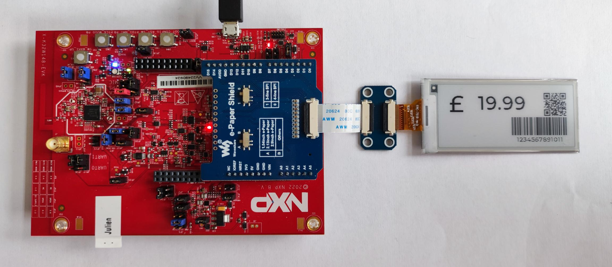

# NXP Application Code Hub

## BLE smart label based on LVGL using Waveshare e-ink display and KW45
This is an example project to demonstrate the use of GUI Guider and LVGL in the context of a BLE Smart Label using NXP KW45B41Z-EVK or K32W148-EVK boards, a Waveshare 2.9" E-Ink display and NXP IoT Toolbox application.

#### Boards: K32W148-EVK, KW45B41Z-EVK
#### Categories: Graphics
#### Peripherals: SPI
#### Toolchains: MCUXpresso IDE

## Table of Contents
1. [Software](#step1)
2. [Hardware](#step2)
3. [Setup](#step3)
4. [Results](#step4)
5. [Support](#step5)
6. [Release Notes](#step6)

## 1. Software
Required software for this demo is simply MCUXpresso for building and flashing the program.
You will also require NXP SDK for K32W148-EVK Version 2.12.3

## 2. Hardware
You will require either a [K32W148-EVK](https://www.nxp.com/design/software/development-software/mcuxpresso-software-and-tools-/k32w148-evaluation-kit-with-multiprotocol-radio:K32W148-EVK) or a [KW45B41Z-EVK](https://www.nxp.com/design/software/development-software/mcuxpresso-software-and-tools-/kw45b41z-evaluation-kit-with-bluetooth-low-energy:KW45B41Z-EVK) board. 
You will also need a [Waveshare 2.9 inches E-Ink display](https://www.waveshare.com/2.9inch-e-paper.htm) and a [Waveshare e-Paper Shield](https://www.waveshare.com/e-paper-shield.htm)

## 3. Setup

### 3.1 Step 1 - Flashing NBU
First step is to flash your K32W1 or KW45 with its corresponding NBU for wireless examples.
Information regarding flashing NBU can be found in section 2.4 and 3.3 of the Getting Started pages of [K32W148-EVK](https://www.nxp.com/document/guide/getting-started-with-the-k32w148-development-platform:GS-K32W148EVK) or [KW45B41Z-EVK](https://www.nxp.com/document/guide/getting-started-with-the-kw45b41z-evaluation-kit:GS-KW45B41ZEVK)

### 3.2 Step 2 - Configuring Shield
Second step is to configure the e-Paper shield.
On the bottom of the shield, you should find three little switches, labeled `ICSP` on one side, and `D11`, `D12` and `D13` on the other one. Make sure all switches are in the `D11`, `D12` and `D13` position.
On the top of the shield, make sure the two switches are in position A and 0.

Then you can plug your E-Ink display to the shield like in the above picture.
Finally, the shield can be plugged on the Arduino Shield provided on your MCU.

### 3.3 Step 3 - Running the Demo
After building the project inside MCUXpresso, you can flash it on your board.
When flashing is done, you should see the screen flickering a few times before displaying a default price, a GTIN number, its corresponding EAN barcode and QR Code.

To change the information displayed on the screen please follow the following steps :

#### 3.3.1 Start Advertising
To enable your board to start its BLE advertising, press and release button SW3, then do the same with SW2.

#### 3.3.2 Connect Phone to Board
Now you need to download NXP IoT Toolbox (available from [Play Store](https://play.google.com/store/apps/details?id=com.freescale.kinetisbletoolbox&hl=en_US) and [App Store](https://apps.apple.com/us/app/iot-toolbox/id1362450908)).
Inside the application, click on the `Wireless UART` widget. Scan should start automatically. When a device called `NXP_WU` appears, click on it. Your phone should now be connecting to the board.

#### 3.3.3 Change Price Information
Now that you are connected to the board, you can change the information displayed on the E-Ink screen. A simple command should be entered : `PX<Currency><Price><GTIN_Numbers>`

Currency is simply a value between 0 and 3 ($/£/€/¥)
Price is a value of your product in cents (i.e 19.99 -> 1999). Max value is 99.99.
GTIN_Numbers are the 13 numbers of your Global Trade Item Number.

## 4. Results

You should now have a customized price, currency and GTIN.

## 6. Support
#### Project Metadata
<!----- Boards ----->
 

<!----- Categories ----->

<!----- Peripherals ----->

<!----- Toolchains ----->

Questions regarding the content/correctness of this example can be entered as Issues within this GitHub repository.

>**Warning**: For more general technical questions regarding NXP Microcontrollers and the difference in expected funcionality, enter your questions on the [NXP Community Forum](https://community.nxp.com/)

## 7. Release Notes
| Version | Description / Update                           | Date                        |
|:-------:|------------------------------------------------|----------------------------:|
| 1.0     | Initial release on Application Code Hub        | juin 16th 2023 |

